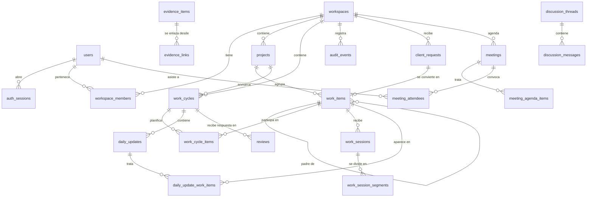
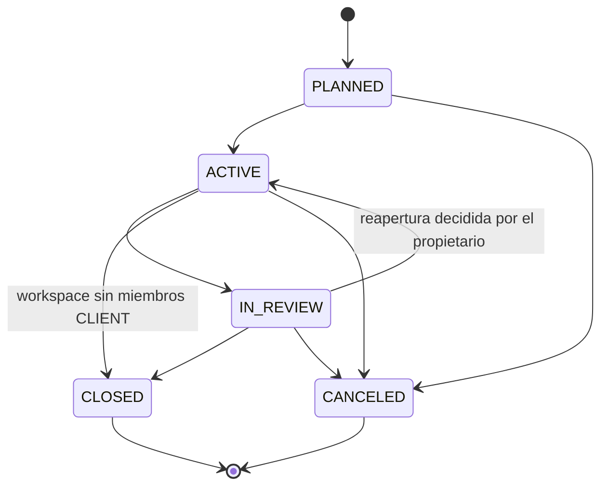
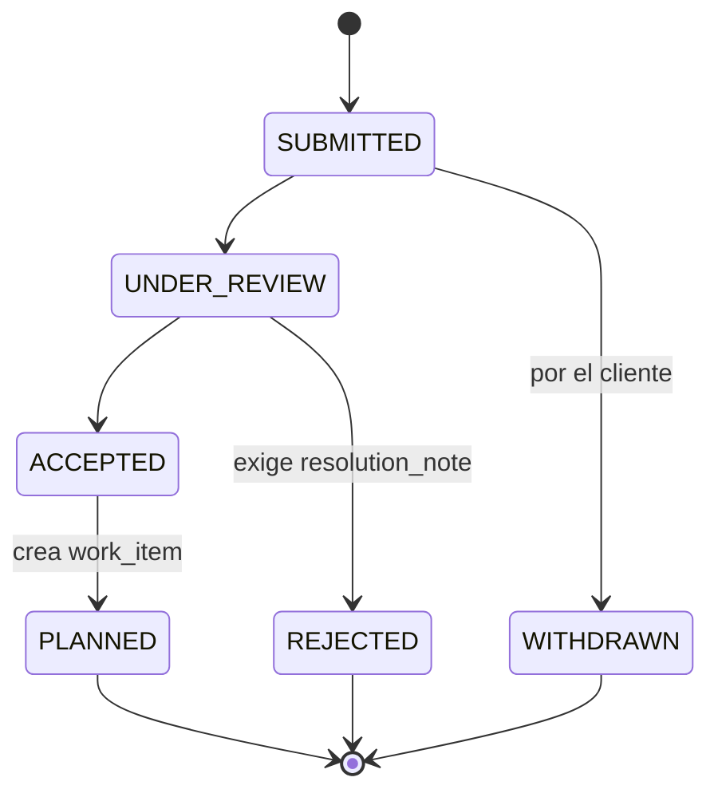

# DATA MODEL (conceptual)

Modelo **conceptual**. No es un esquema ejecutable, no hay migraciones, no hay decisión de motor de
base de datos comprometida en este documento. Ver [`AGENTS.md`](../AGENTS.md) §5.

> Revisado en la **iteración 0.1**: relaciones N:M normalizadas, evidencias multi-contexto,
> revisiones sin filas pendientes, identificador opaco de workspace y zonas horarias cerradas.

---

## 1. Convenciones

- Identificadores internos: `id`, opaco y no adivinable (UUID v7 o similar). No se exponen enteros
  correlativos.
- **Identificadores públicos:** las entidades que aparecen en rutas llevan además `public_id`,
  opaco y no correlativo. Nunca se usa un nombre legible como identificador de seguridad (§4.3).
- Marcas de tiempo: `created_at`, `updated_at`, siempre **UTC** (§7).
- Borrado: **lógico** (`archived_at`) para todo lo que pueda haber sido visto por un cliente.
  Borrado físico solo para borradores nunca publicados.
- Toda entidad de contenido lleva `workspace_id` **denormalizado**, aunque sea derivable. Es la
  columna sobre la que se aplica el aislamiento; derivarla por join es una vía de fuga.
  Ver [`ADR-002`](decisions/ADR-002-workspace-boundary.md).
- Toda entidad de contenido lleva `created_by`.
- **Sin listas de claves foráneas.** Toda relación N:M es una entidad propia (§6).

## 2. Diagrama de relaciones



`discussion_threads` y `evidence_links` se anclan de forma polimórfica a varios tipos de contexto;
esas aristas no se dibujan para no saturar el diagrama. Ver §4.11 y §4.12.

## 3. Enums

| Enum | Valores |
|---|---|
| `workspace_type` | `PERSONAL`, `CLIENT`, `BUSINESS` |
| `member_role` | `OWNER`, `MEMBER`, `CLIENT`, `VIEWER` |
| `member_status` | `INVITED`, `ACTIVE`, `SUSPENDED`, `REMOVED` |
| `visibility` | `PRIVATE`, `INTERNAL`, `CLIENT_VISIBLE` |
| `publication_state` | `DRAFT`, `PUBLISHED` |
| `work_item_type` | `INITIATIVE`, `FEATURE`, `TASK`, `BUG`, `RESEARCH` |
| `work_state` | `BACKLOG`, `READY`, `IN_PROGRESS`, `IN_REVIEW`, `DONE`, `BLOCKED`, `CANCELED` |
| `cycle_state` | `PLANNED`, `ACTIVE`, `IN_REVIEW`, `CLOSED`, `CANCELED` |
| `session_state` | `RUNNING`, `PAUSED`, `COMPLETED`, `DISCARDED` |
| `activity_type` | `DEVELOPMENT`, `DESIGN`, `RESEARCH`, `REVIEW`, `MEETING`, `SUPPORT`, `PLANNING`, `OTHER` |
| `evidence_type` | `COMMIT`, `PULL_REQUEST`, `TEST_RUN`, `EXPERIMENT`, `DOCUMENT`, `LINK`, `SCREENSHOT`, `NOTE` |
| `context_type` | `WORK_CYCLE`, `WORK_ITEM`, `DAILY_UPDATE`, `WORK_SESSION`, `MEETING`, `CLIENT_REQUEST` |
| `request_state` | `SUBMITTED`, `UNDER_REVIEW`, `ACCEPTED`, `PLANNED`, `REJECTED`, `WITHDRAWN` |
| `request_priority` | `LOW`, `NORMAL`, `HIGH`, `URGENT` *(declarada por el cliente, no vinculante)* |
| `meeting_state` | `SCHEDULED`, `HELD`, `CANCELED` |
| `agenda_item_state` | `PROPOSED`, `ACCEPTED`, `DISCUSSED`, `DEFERRED`, `DROPPED` |
| `attendance_state` | `INVITED`, `ATTENDED`, `ABSENT`, `EXCUSED` |
| `review_state` | `ACKNOWLEDGED`, `APPROVED`, `CHANGES_REQUESTED` |

**Cambios de la iteración 0.1**

- `context_type` sustituye a `thread_context_type` y sirve tanto a `discussion_threads` como a
  `evidence_links`. Incorpora `WORK_SESSION` y `CLIENT_REQUEST`.
- `review_state` **ya no incluye `PENDING`**. Una revisión existe solo si el cliente la envió; lo
  pendiente es una condición derivada, no una fila. Ver §4.16.

## 4. Entidades

### 4.1 `users`

Identidad global. **No pertenece a ningún workspace.**

| Campo | Tipo | Notas |
|---|---|---|
| `id`, `public_id` | id | |
| `email` | texto | Único, en minúsculas. |
| `display_name` | texto | |
| `password_hash` | texto | Conceptual. Mecanismo sin decidir. |
| `locale` | texto | Preferencia de presentación. Ver `OD-14`. |
| `preferred_timezone` | texto, nulable | Zona IANA **opcional** del usuario (§7). |
| `is_demo` | bool | Usuario sintético de `DEMO_MODE`. Nunca en producción real. |
| `created_at`, `updated_at`, `archived_at` | ts | |

Un usuario sin ningún `workspace_members` activo no ve absolutamente nada.

### 4.2 `auth_sessions`

| Campo | Tipo | Notas |
|---|---|---|
| `id` | id | |
| `user_id` | fk → users | |
| `issued_at`, `last_seen_at`, `expires_at`, `revoked_at` | ts | |
| `user_agent`, `ip_hash` | texto | Para que el usuario reconozca sus sesiones. IP hasheada. |
| `is_demo` | bool | |

**No lleva `workspace_id`.** El workspace activo es estado de navegación, no de sesión — así se
evita que una sesión "recuerde" un permiso.

### 4.3 `workspaces`

| Campo | Tipo | Notas |
|---|---|---|
| `id` | id | Interno. |
| `public_id` | texto | **Opaco y no correlativo.** Es lo que aparece en las rutas. |
| `name` | texto | Legible y **decorativo**. Sin unicidad global (§4.3.1). |
| `type` | `workspace_type` | Intención, no permiso. |
| `default_visibility` | `visibility` | `PRIVATE` en `PERSONAL`, `INTERNAL` en el resto. |
| `timezone` | texto | **Zona IANA obligatoria.** Define los límites de día y de ciclo (§7). |
| `cycle_length_days` | int | Por defecto 7. |
| `cycle_start_weekday` | int | 1 = lunes. |
| `created_by` | fk → users | |
| `created_at`, `updated_at`, `archived_at` | ts | |

#### 4.3.1 El nombre no es un identificador

El campo `slug` con unicidad global **se ha eliminado**. Motivos:

1. Un identificador legible y adivinable invita al sondeo de rutas.
2. Una validación de unicidad global es un oráculo de existencia: *"ese nombre ya está en uso"*
   revela que otro workspace existe, y a veces quién es el cliente de otra persona.

Reglas derivadas:

- Las rutas usan `public_id`, opaco. Ver [`INFORMATION-ARCHITECTURE.md`](INFORMATION-ARCHITECTURE.md) §4.
- `name` es libre. **No se valida su unicidad frente a workspaces ajenos** y no existe ningún
  mensaje del tipo *"nombre no disponible"*.
- Como mucho se avisa de duplicado **entre los workspaces del propio usuario**, y como advertencia,
  no como error.

### 4.4 `workspace_members`

La tabla de autorización. Todo empieza aquí.

| Campo | Tipo | Notas |
|---|---|---|
| `id` | id | |
| `workspace_id` | fk | |
| `user_id` | fk | |
| `role` | `member_role` | |
| `status` | `member_status` | Solo `ACTIVE` concede acceso. |
| `invited_by`, `invited_at`, `joined_at`, `removed_at` | | |

**Invariantes**

- **Unicidad de `(workspace_id, user_id)`.** Un usuario tiene como mucho una membresía por
  workspace, y por tanto **un solo rol** en él.
- El rol **nunca es global**: se define por membresía. El mismo usuario puede ser `OWNER` en un
  workspace y `CLIENT` en otro sin ninguna relación entre ambos (`OD-11`, cerrada).
- Un workspace admite **varios miembros con rol `CLIENT`** (`OD-02`, cerrada). El MVP arranca con
  uno, pero ninguna regla ni consulta puede asumir que hay exactamente uno.
- Todo workspace no archivado tiene ≥ 1 miembro `ACTIVE` con rol `OWNER`.

### 4.5 `projects`

Agrupación estable dentro de un workspace; sobrevive a los ciclos.
**Entidad estructural**: no tiene `publication_state` (§5).

| Campo | Tipo | Notas |
|---|---|---|
| `id`, `public_id`, `workspace_id`, `created_by` | | |
| `name`, `description` | texto | |
| `visibility` | `visibility` | Sin publicación asociada. |
| `status` | texto | `ACTIVE` \| `PAUSED` \| `ARCHIVED`. |
| `created_at`, `updated_at`, `archived_at` | | |

**Acceso del cliente a un proyecto** — ver §5.3. En resumen: derivado, de solo lectura y a nivel de
etiqueta. El cliente nunca obtiene un listado de proyectos.

### 4.6 `work_cycles`

Semana o ciclo de trabajo. **Entidad publicable.**

| Campo | Tipo | Notas |
|---|---|---|
| `id`, `public_id`, `workspace_id`, `created_by` | | |
| `project_id` | fk, nulable | Un ciclo puede abarcar todo el workspace. |
| `label` | texto | P. ej. `2026-W31`. |
| `starts_on`, `ends_on` | **fecha civil** | Interpretadas en `workspaces.timezone` (§7). |
| `state` | `cycle_state` | |
| `goal` | texto | Objetivo declarado del ciclo. |
| `closing_summary` | texto | Resumen de cierre, redactado por el propietario. |
| `visibility` | `visibility` | |
| `publication_state` | `publication_state` | Se publica al preparar el cierre. |
| `published_at`, `closed_at` | ts | |
| `hours_snapshot` | json, nulable | Agregados congelados al publicar el cierre. Ver `OD-01`. |
| `closed_without_review` | bool | Constancia de cierre sin revisión del cliente (§4.16). |

**Invariante:** como máximo un ciclo `ACTIVE` por `(workspace_id, project_id)`.



**Ninguna transición la provoca el cliente.** Una revisión es informativa (`OD-03`, cerrada): el
propietario decide si cierra o reabre. Cerrar sin revisión recibida es legítimo y se marca con
`closed_without_review = true`.

### 4.7 `work_items`

Unidad de trabajo, jerárquica. **Entidad publicable.**

| Campo | Tipo | Notas |
|---|---|---|
| `id`, `public_id`, `workspace_id`, `created_by` | | |
| `project_id` | fk | |
| `parent_id` | fk → work_items, nulable | Jerarquía. |
| `path` | texto | Materialización del ancestro para consultas de subárbol. |
| `type` | `work_item_type` | |
| `title`, `description` | texto | |
| `work_state` | `work_state` | Estado **funcional** vigente. |
| `visibility` | `visibility` | |
| `publication_state` | `publication_state` | |
| `client_facing_title` | texto, nulable | Título alternativo para el cliente. |
| `estimate_minutes` | int, nulable | |
| `order_key` | texto | Ordenación manual dentro del backlog. |
| `source_client_request_id` | fk, nulable | Si nació de una solicitud (§4.14). |
| `created_at`, `updated_at`, `archived_at` | | |

**El work item no guarda ciclo.** Su participación en uno o varios ciclos vive en
`work_cycle_items` (§4.8).

**Reglas de jerarquía**

- Anidamiento sugerido: `INITIATIVE` → `FEATURE` → (`TASK` \| `BUG` \| `RESEARCH`).
- Un hijo **no puede ser más visible que su padre**. Se valida al escribir.
- No se permiten ciclos en `parent_id`.
- Solo los nodos hoja deberían recibir `work_sessions`; los nodos padre agregan.

### 4.8 `work_cycle_items`

Participación de un work item en un ciclo. Cierra `OD-08`.

| Campo | Tipo | Notas |
|---|---|---|
| `id`, `workspace_id` | | |
| `work_cycle_id`, `work_item_id` | fk | Únicos en conjunto. |
| `is_planned` | bool | Comprometido al abrir el ciclo, o incorporado sobre la marcha. |
| `carried_from_cycle_id` | fk, nulable | Ciclo de procedencia si viene arrastrado. |
| `work_state_at_start` | `work_state` | Estado al entrar en el ciclo. |
| `work_state_at_close` | `work_state`, nulable | Estado al cerrarse el ciclo. |
| `order_key` | texto | Orden dentro del ciclo. |
| `added_at`, `added_by`, `removed_at` | | |

**Reglas**

- Un work item **participa en varios ciclos sin duplicarse**. Arrastrar crea una fila nueva en el
  ciclo destino con `carried_from_cycle_id`; el work item es el mismo, con la misma identidad,
  el mismo historial y las mismas evidencias.
- `work_state_at_start` / `work_state_at_close` congelan la foto por ciclo. Sin ellos, un cierre
  semanal consultado meses después mostraría el estado actual y no el de entonces.
- Las horas de un ciclo se atribuyen por `work_sessions.work_cycle_id`, no por participación: un
  item presente en dos ciclos no duplica su tiempo.

### 4.9 `work_sessions`

Un periodo de trabajo sobre un work item. **El tiempo no vive aquí: vive en los segmentos.**
**Entidad estructural**: sin `publication_state`, nunca legible por un `CLIENT`.

| Campo | Tipo | Notas |
|---|---|---|
| `id`, `workspace_id`, `created_by` | | `created_by` es quien trabajó. |
| `work_item_id` | fk | |
| `work_cycle_id` | fk, nulable | Ciclo al que se imputa el tiempo. Se fija al iniciar. |
| `activity_type` | `activity_type` | |
| `state` | `session_state` | |
| `started_at`, `ended_at` | ts (UTC) | Extremos; el tiempo efectivo se suma de los segmentos. |
| `outcome_note` | texto | Resultado del trabajo. Se pide al cerrar. |
| `is_manual_entry` | bool | Registrada a mano en lugar de cronometrada. |
| `visibility` | `visibility` | Por defecto `INTERNAL`. |
| `created_at`, `updated_at` | | |

**Invariante:** como máximo **una** sesión `RUNNING` por usuario en toda la aplicación. Iniciar otra
exige **confirmación explícita** y entonces la pausa de la anterior y el arranque de la nueva
ocurren en **una sola operación atómica** (ver [F3 A2](USER-FLOWS.md#f3--iniciar-pausar-y-finalizar-una-sesión-de-trabajo)).

Su tiempo llega al cliente agregado a través de `work_cycles.hours_snapshot` y de las
actualizaciones diarias.

### 4.10 `work_session_segments`

Intervalo continuo de trabajo. Pausar cierra un segmento; reanudar abre otro.

| Campo | Tipo | Notas |
|---|---|---|
| `id`, `workspace_id` | | |
| `work_session_id` | fk | |
| `started_at`, `ended_at` | ts (UTC) | `ended_at` nulo mientras el segmento corre. |
| `duration_seconds` | int, derivado | Materializado al cerrar el segmento. |
| `adjustment_reason` | texto, nulable | Obligatorio si el segmento se editó a mano. |
| `created_at`, `updated_at` | | |

**Invariantes:** un solo segmento abierto por sesión · sin solapes dentro de la sesión ·
`ended_at > started_at` · duración de la sesión = Σ `duration_seconds`, **nunca**
`ended_at − started_at` · editar un segmento cerrado exige `adjustment_reason` y emite
`work_session.time_adjusted`.

### 4.11 `daily_updates` y `daily_update_work_items`

Narrativa de un día. **Entidad publicable.** Es el artefacto principal que lee el cliente.

| Campo | Tipo | Notas |
|---|---|---|
| `id`, `public_id`, `workspace_id`, `created_by` | | |
| `work_cycle_id` | fk | |
| `update_date` | **fecha civil** | En `workspaces.timezone`. Único por `(work_cycle_id, created_by, update_date)`. |
| `summary` | texto | Qué se hizo. |
| `blockers`, `next_steps` | texto, nulable | |
| `visibility`, `publication_state` | | |
| `published_at` | ts, nulable | |
| `hours_summary` | json, nulable | Agregado del día al publicar. Ver `OD-01`. |

`daily_update_work_items` — sustituye a la antigua lista `linked_work_item_ids`:

| Campo | Tipo | Notas |
|---|---|---|
| `id`, `workspace_id` | | |
| `daily_update_id`, `work_item_id` | fk | Únicos en conjunto. |
| `order_key` | texto | Orden de presentación. |
| `note` | texto, nulable | Matiz específico de ese item ese día. |

Al publicar se valida que **todo work item enlazado sea al menos tan visible como la actualización**.
Si no, la publicación se detiene y se ofrece elevar la visibilidad explícitamente (regla R10).

### 4.12 `evidence_items` y `evidence_links`

Prueba del trabajo. **Referencia**, no almacén de archivos en el MVP (ver `OD-05`).
**`evidence_items` es publicable; `evidence_links` es una relación pura.**

`evidence_items`

| Campo | Tipo | Notas |
|---|---|---|
| `id`, `public_id`, `workspace_id`, `created_by` | | |
| `type` | `evidence_type` | |
| `title`, `description` | texto | |
| `url` | texto, nulable | Enlace externo (commit, PR, ejecución de tests, documento). |
| `reference` | texto, nulable | SHA, número de PR, identificador de ejecución. |
| `captured_at` | ts | Cuándo ocurrió, no cuándo se registró. |
| `visibility`, `publication_state` | | Propiedad **de la evidencia**, no del contexto. |
| `published_at` | ts, nulable | |

`evidence_links` — sustituye a `attached_to_type` / `attached_to_id`:

| Campo | Tipo | Notas |
|---|---|---|
| `id`, `workspace_id`, `created_by` | | |
| `evidence_item_id` | fk | |
| `context_type` | `context_type` | `WORK_SESSION`, `WORK_ITEM`, `DAILY_UPDATE`, `WORK_CYCLE`, `MEETING`, `CLIENT_REQUEST`. |
| `context_id` | id | |
| `note` | texto, nulable | Por qué esta evidencia importa **en este contexto**. |
| `order_key` | texto | |
| `created_at` | ts | Únicos: `(evidence_item_id, context_type, context_id)`. |

Un commit puede acreditar a la vez la sesión en que se escribió, la funcionalidad que implementa, la
actualización del día y el cierre de la semana — **con una sola fila en `evidence_items`**. Antes
exigía cuatro copias, cada una con su propia visibilidad y su propio riesgo de divergencia.

#### 4.12.1 Visibilidad de una evidencia enlazada a varios contextos

Regla **conjuntiva**. Un `CLIENT` ve una evidencia **dentro de un contexto** si y solo si:

```
ve_evidencia_en_contexto(cliente, evidencia, contexto):
      contexto es accesible para el cliente        (regla del §5.2)
  Y   evidencia.visibility        == CLIENT_VISIBLE
  Y   evidencia.publication_state == PUBLISHED
  Y   existe evidence_links(evidencia, contexto)
```

Consecuencias, todas deliberadas:

1. **Un enlace nunca eleva nada.** Enlazar una evidencia interna a una actualización publicada no
   la hace visible; la publicación se detiene y la lista como pendiente (regla R10).
2. **Publicar un contexto no publica sus evidencias.** Son actos separados, ambos explícitos.
3. **Una evidencia visible en un contexto no lo es en todos.** Si está enlazada a una sesión
   interna y a una actualización publicada, el cliente la ve solo desde la actualización. La sesión
   sigue siendo invisible.
4. **El índice de evidencias del cliente** (`/c/:ws/activity/evidence`) lista las evidencias
   `CLIENT_VISIBLE` + `PUBLISHED` que tengan **al menos un enlace a un contexto accesible** para ese
   cliente. Sin esa condición, una evidencia publicada pero solo enlazada a contenido interno
   aparecería huérfana en el índice: una fuga silenciosa.
5. **Retirar el último enlace accesible** la retira del índice, aunque siga publicada.

### 4.13 `discussion_threads` y `discussion_messages`

Hilo de conversación anclado a un contexto. **No existen hilos sueltos.**
**Entidades estructurales**: sin `publication_state`; su acceso se deriva del ancla.

`discussion_threads`

| Campo | Tipo | Notas |
|---|---|---|
| `id`, `public_id`, `workspace_id`, `created_by` | | |
| `context_type` | `context_type` | Incluye **`CLIENT_REQUEST`** (§4.14). |
| `context_id` | id | Único por `(context_type, context_id)` salvo hilos múltiples explícitos. |
| `title` | texto, nulable | Derivado del contexto si falta. |
| `is_resolved`, `resolved_at`, `resolved_by` | | Solo el `OWNER` resuelve. |
| `last_message_at` | ts | Para ordenar. |

**El hilo no almacena `visibility`.** Se eliminó en la iteración 0.1: una copia de la visibilidad del
ancla es una copia que puede quedar desincronizada, y la vía de fuga más probable del diseño. La
accesibilidad se **resuelve siempre contra el ancla, en el momento de la consulta**.

`discussion_messages`

| Campo | Tipo | Notas |
|---|---|---|
| `id`, `workspace_id`, `created_by` | | |
| `thread_id` | fk | Un mensaje no cambia de hilo. |
| `body` | texto | Texto plano o markdown restringido. Sin HTML. |
| `is_clarification_request` | bool | Genera pendiente para el `OWNER`. |
| `answered_by_message_id` | fk, nulable | Enlaza la respuesta a la aclaración. |
| `edited_at`, `deleted_at` | ts | Borrado lógico: se conserva el hueco. Ver `OD-06`. |

En un workspace con **varios miembros `CLIENT`**, un hilo anclado a contenido compartido es común a
todos ellos: cada cliente ve los mensajes de los demás. Es coherente con que el ancla también sea
compartida. La excepción son los hilos anclados a `CLIENT_REQUEST`, que siguen la visibilidad de la
solicitud (§4.14).

### 4.14 `client_requests`

Petición del cliente. Cola propia, **fuera del backlog**. **Entidad estructural.**
Ver [`ADR-003`](decisions/ADR-003-client-interaction.md).

| Campo | Tipo | Notas |
|---|---|---|
| `id`, `public_id`, `workspace_id`, `created_by` | | `created_by` normalmente un `CLIENT`. |
| `title`, `body` | texto | |
| `declared_priority` | `request_priority` | Declarada por el cliente, **no vinculante**. |
| `state` | `request_state` | |
| `triaged_by`, `triaged_at` | | |
| `resolution_note` | texto, nulable | **Obligatorio** en `REJECTED`. |
| `converted_work_item_id` | fk, nulable | Único. Enlace bidireccional con `work_items`. |
| `target_work_cycle_id` | fk, nulable | Relleno en `PLANNED`. |
| `origin_thread_id` | fk, nulable | Hilo del que **nació** la solicitud, si vino de un comentario. |

**La conversación sobre una solicitud es un hilo anclado a ella**, con
`context_type = CLIENT_REQUEST` y `context_id = client_requests.id`. Se eliminó el antiguo campo
`related_thread_id`: una solicitud es un contexto de conversación de pleno derecho, como un ciclo o
una actualización, y no un registro que apunta a una conversación suelta.

`origin_thread_id` cumple otra función y se conserva: registra la procedencia cuando el propietario
convierte un comentario en solicitud ([F9 A2](USER-FLOWS.md#f9--el-cliente-comenta-o-solicita-aclaración)).



Convertir una petición **crea** un `work_item` nuevo; no modifica ninguno existente.

### 4.15 `meetings`, `meeting_agenda_items` y `meeting_attendees`

`meetings` — **entidad publicable**

| Campo | Tipo | Notas |
|---|---|---|
| `id`, `public_id`, `workspace_id`, `created_by` | | |
| `work_cycle_id` | fk, nulable | |
| `title` | texto | |
| `scheduled_start`, `scheduled_end`, `actual_start`, `actual_end` | ts (UTC) | Se presentan en la zona del workspace. |
| `state` | `meeting_state` | |
| `location_note` | texto | Enlace o lugar. Sin integración de calendario en MVP. |
| `notes` | texto | Notas de la reunión. |
| `decisions` | texto | **Decisiones tomadas**, campo aparte a propósito. |
| `next_steps` | texto | |
| `visibility`, `publication_state` | | |

`decisions` es un campo propio porque es lo que se vuelve a consultar meses después. No debe quedar
enterrado en las notas.

`meeting_attendees` — sustituye a la lista `attendee_user_ids`:

| Campo | Tipo | Notas |
|---|---|---|
| `id`, `workspace_id` | | |
| `meeting_id`, `user_id` | fk | Únicos en conjunto. |
| `attendance` | `attendance_state` | |
| `is_visible_to_client` | bool | Permite registrar asistentes internos sin exponerlos. |

`meeting_agenda_items`

| Campo | Tipo | Notas |
|---|---|---|
| `id`, `workspace_id`, `created_by` | | El `CLIENT` puede crear: su único punto de escritura sobre reuniones. |
| `meeting_id` | fk | |
| `title`, `detail` | texto | |
| `state` | `agenda_item_state` | El `OWNER` acepta o difiere lo propuesto. |
| `order_key` | texto | |
| `outcome_note` | texto, nulable | Resultado tras tratarlo. |
| `related_work_item_id` | fk, nulable | |

### 4.16 `reviews`

Respuesta formal de un cliente al cierre de un ciclo. **Entidad estructural, append-only.**

| Campo | Tipo | Notas |
|---|---|---|
| `id`, `workspace_id`, `created_by` | | `created_by` = el `CLIENT` que responde. |
| `work_cycle_id` | fk | |
| `state` | `review_state` | `ACKNOWLEDGED` \| `APPROVED` \| `CHANGES_REQUESTED`. |
| `comment` | texto, nulable | **Obligatorio** en `CHANGES_REQUESTED`. |
| `submitted_at` | ts | |
| `supersedes_review_id` | fk, nulable | Encadena la respuesta anterior del **mismo** cliente. |

#### 4.16.1 No existen revisiones pendientes como filas

La iteración 0 contenía una contradicción: las revisiones se declaraban *append-only* y a la vez se
creaba una fila `PENDING` por cliente al publicar el cierre — una fila que después habría que
actualizar, que es justo lo que *append-only* prohíbe.

**Resolución para el MVP:** una fila de `reviews` representa **únicamente una respuesta realmente
enviada**. Por eso `PENDING` desaparece del enum `review_state`.

Lo pendiente se **deriva**:

```
revision_pendiente(ciclo, cliente):
      ciclo.publication_state == PUBLISHED
  Y   ciclo.state == IN_REVIEW
  Y   miembro_activo(cliente, ciclo.workspace).role == CLIENT
  Y   no existe reviews(ciclo, cliente)
```

Consecuencias:

- Publicar un cierre **no escribe nada** en `reviews`. Ya no existe el evento `review.requested`.
- Añadir un cliente a mitad de ciclo no exige rellenar filas retroactivas: queda pendiente por
  derivación, sin migración de datos.
- Cambiar de opinión **crea otra fila** con `supersedes_review_id`. Nunca se actualiza una existente.
- El cliente tiene **`C` y `R`** sobre `reviews`. **No tiene `U`.**
- Con varios clientes hay **una cadena de revisiones por cliente**. El propietario ve el estado de
  cada uno; no existe un estado agregado del ciclo derivado de ellas (`OD-03`: la revisión es
  informativa).
- El propietario puede cerrar el ciclo sin ninguna revisión recibida. Queda constancia en
  `work_cycles.closed_without_review`.

### 4.17 `audit_events`

Append-only. Nunca se actualiza ni se borra.

| Campo | Tipo | Notas |
|---|---|---|
| `id`, `workspace_id` | | |
| `actor_user_id` | fk, nulable | Nulo para eventos del sistema. |
| `actor_role` | `member_role` | Rol en el momento del hecho, congelado. |
| `event_type` | texto | `entidad.acción`, p. ej. `daily_update.published`. |
| `entity_type`, `entity_id` | | |
| `before`, `after` | json, nulable | Solo los campos relevantes, nunca el registro entero. |
| `occurred_at` | ts (UTC) | |
| `request_id` | texto | Correlación entre eventos de una misma acción. |

**Se auditan siempre:** cambios de `visibility`, cambios de `publication_state`, transiciones de
`cycle_state`, ajustes de tiempo, cambios de miembros y roles, triaje de solicitudes, envío de
revisiones, y **todo acceso de un `CLIENT`** a contenido publicado (criterio E3 de
[`PRODUCT-SCOPE.md`](PRODUCT-SCOPE.md) §7). Retención sin decidir: `OD-12`.

## 5. Entidades publicables frente a entidades estructurales

Corrección de la iteración 0.1. La regla `CLIENT_VISIBLE + PUBLISHED` se aplicaba antes de forma
indiscriminada a *cualquier* registro, y la mitad de las entidades no tienen ni pueden tener
`publication_state`.

### 5.1 Clasificación

| Clase | Entidades | Ejes que llevan |
|---|---|---|
| **Publicables** | `work_cycles`, `work_items`, `daily_updates`, `evidence_items`, `meetings` | `visibility` + `publication_state` |
| **Estructurales con visibilidad** | `projects`, `work_sessions` | solo `visibility` |
| **Estructurales derivadas** | `discussion_threads`, `discussion_messages`, `evidence_links`, `work_cycle_items`, `daily_update_work_items`, `meeting_agenda_items`, `meeting_attendees`, `work_session_segments` | ninguno propio: heredan del ancla o del padre |
| **De canal del cliente** | `client_requests`, `reviews` | ninguno: acceso por autoría y rol |
| **De sistema** | `users`, `auth_sessions`, `workspaces`, `workspace_members`, `audit_events` | ninguno |

### 5.2 Regla de acceso, por clase

```
puede_ver(usuario, registro):
  m = miembro_activo(usuario, registro.workspace_id)
  si no m                          -> NO (responder 404)
  si m.role == OWNER               -> SÍ

  segun clase(registro):
    PUBLICABLE:
      si m.role == CLIENT          -> visibility == CLIENT_VISIBLE
                                      Y publication_state == PUBLISHED
      si m.role in (MEMBER,VIEWER) -> visibility != PRIVATE
                                      O created_by == usuario

    ESTRUCTURAL_CON_VISIBILIDAD:
      si m.role == CLIENT          -> NO por acceso directo (§5.3)
      si no                        -> visibility != PRIVATE O created_by == usuario

    ESTRUCTURAL_DERIVADA:
      -> puede_ver(usuario, ancla_o_padre(registro))

    CANAL_DEL_CLIENTE:
      si m.role == CLIENT          -> created_by == usuario   (ver OD-17)
      si no                        -> SÍ

    DE_SISTEMA:
      -> solo OWNER, salvo el perfil propio
```

Nótese que **un `CLIENT` nunca accede directamente** a `projects` ni a `work_sessions`, aunque
lleven `visibility`. Su relación con ambos es indirecta: etiqueta en un caso (§5.3), agregado en el
otro ([`ROLES-AND-PERMISSIONS.md`](ROLES-AND-PERMISSIONS.md) §6).

### 5.3 Cómo accede el cliente al proyecto que contiene contenido publicado

Un `projects` no es publicable, pero un ciclo publicado pertenece a uno. Sin una regla explícita, el
nombre del proyecto se filtraría por la puerta de atrás.

**Regla — acceso derivado, de solo lectura y a nivel de etiqueta:**

1. **No existe listado de proyectos para el cliente.** No hay ruta `/c/:ws/projects`. Cualquier
   intento devuelve 404.
2. El **nombre** del proyecto acompaña a un ciclo, work item o actualización accesible **solo si**
   `projects.visibility = CLIENT_VISIBLE`. En caso contrario el contenido se muestra sin etiqueta de
   proyecto: se omite el campo, no se sustituye por un marcador.
3. `projects.description` **nunca** se expone al cliente en el MVP.
4. Al publicar por primera vez contenido de un proyecto `INTERNAL`, la vista previa avisa: *el
   nombre del proyecto no se mostrará*, y ofrece elevarlo. Nunca lo eleva sola.
5. Si el workspace tiene un solo proyecto, la etiqueta se omite siempre por irrelevante
   ([`INFORMATION-ARCHITECTURE.md`](INFORMATION-ARCHITECTURE.md) §5).

El mismo razonamiento aplica a `work_cycles.label` y a cualquier otro contenedor que llegue a
existir: **un contenedor no se vuelve visible por contener algo visible.**

## 6. Relaciones N:M normalizadas

Ninguna entidad guarda listas de claves foráneas. Cuatro relaciones se han convertido en entidades:

| Relación | Sustituye a | Aporta |
|---|---|---|
| `work_cycle_items` | `work_items.work_cycle_id` implícito | Participación en varios ciclos, arrastre y estado congelado por ciclo |
| `daily_update_work_items` | `daily_updates.linked_work_item_ids` | Orden y nota por item |
| `meeting_attendees` | `meetings.attendee_user_ids` | Asistencia real y exposición selectiva al cliente |
| `evidence_links` | `evidence_items.attached_to_type/_id` | Una evidencia en varios contextos sin duplicarse |

Motivo común: una lista de identificadores no admite atributos de la relación, no se puede consultar
en sentido inverso sin recorrer todas las filas y no se puede restringir por integridad
referencial. Toda relación que necesite decir *algo* sobre sí misma es una entidad.

## 7. Tiempo y zonas horarias

Cierra `OD-07`.

| Regla | Detalle |
|---|---|
| **Almacenamiento** | Todos los instantes se guardan en **UTC**. Sin excepción. |
| **Zona del workspace** | `workspaces.timezone` es una **zona IANA obligatoria** (p. ej. `America/Lima`). No se admiten abreviaturas como `EST`, `CST` o `PET`: son ambiguas y no describen el horario de verano. |
| **Zona del usuario** | `users.preferred_timezone` es una zona IANA **opcional**, solo de presentación. Nunca afecta a un cálculo. |
| **Límites de día y de ciclo** | Se calculan **siempre en la zona del workspace**. Un día es el intervalo civil de esa zona; una semana empieza en `cycle_start_weekday` de esa zona. |
| **Fechas civiles** | `work_cycles.starts_on`, `work_cycles.ends_on` y `daily_updates.update_date` son **fechas sin hora**, interpretadas en la zona del workspace. No son instantes y no se convierten. |
| **Presentación** | Los instantes se muestran en `users.preferred_timezone` si existe; si no, en la del workspace. Cuando ambas difieren, la interfaz indica la zona junto a la hora. |
| **Atribución** | Una sesión pertenece al día y al ciclo que le corresponden **en la zona del workspace**, no en la del usuario. Trabajar de viaje no reasigna el trabajo a otro día. |
| **Cambios de zona** | Cambiar `workspaces.timezone` es una operación auditada que **no** reasigna datos históricos. Los ciclos y actualizaciones ya creados conservan sus fechas civiles. |

Configuración inicial del workspace de ejemplo: `America/Lima`.

## 8. Reglas transversales de integridad

| # | Regla |
|---|---|
| R1 | Todo registro de contenido tiene `workspace_id`. Toda consulta filtra por él. |
| R2 | Un hijo nunca es más visible que su padre (`work_items`, `projects` → contenido). |
| R3 | `PUBLISHED` sin `CLIENT_VISIBLE` es válido pero invisible para el cliente: publicar no es compartir. |
| R4 | Un `CLIENT` nunca es `created_by` de: `work_items`, `work_sessions`, `work_session_segments`, `evidence_items`, `evidence_links`, `daily_updates`, `work_cycles`, `work_cycle_items`. |
| R5 | Como máximo un ciclo `ACTIVE` por `(workspace_id, project_id)`. |
| R6 | Como máximo una sesión `RUNNING` por usuario, globalmente. |
| R7 | Como máximo un segmento abierto por sesión; sin solapes. |
| R8 | Todo workspace activo tiene ≥ 1 `OWNER` activo. |
| R9 | Cerrar un ciclo exige que no queden sesiones `RUNNING` ni `PAUSED` imputadas a él. |
| R10 | Publicar exige que no haya referencias colgando hacia contenido menos visible: work items enlazados y evidencias enlazadas deben ser al menos tan visibles como lo que se publica. |
| R11 | `(workspace_id, user_id)` es único en `workspace_members`: un usuario, un rol por workspace. |
| R12 | Un `evidence_links` nunca eleva la visibilidad de la evidencia ni la del contexto. |
| R13 | Un contenedor no se vuelve visible por contener algo visible (§5.3). |
| R14 | `reviews` no se actualiza nunca: cambiar de respuesta encadena una fila nueva. |
| R15 | Ninguna fila de `reviews` se crea sin acción explícita de un cliente. |

## 9. Extensión futura reservada (no implementar)

`tool_usage_entries` — registro manual o estimado del uso de herramientas y agentes por sesión de
trabajo. Se enlazaría a `work_sessions`. Fuera del MVP; ver `OD-15`. Se menciona para que el modelo
de sesiones no cierre la puerta a entidades hijas adicionales.

## 10. Decisiones abiertas relacionadas

`OD-01` (agregación de horas) · `OD-04` (despublicar) · `OD-05` (archivos de evidencia) ·
`OD-06` (edición de mensajes) · `OD-12` (retención de auditoría) · `OD-15` (uso de herramientas) ·
`OD-17` (visibilidad cruzada entre varios clientes del mismo workspace).

Cerradas en la iteración 0.1: `OD-02`, `OD-03`, `OD-07`, `OD-08`, `OD-11`.
