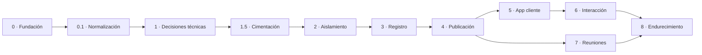

# MVP PLAN

Qué se construye, en qué orden y qué se deja fuera. **Este documento no autoriza a escribir código.**
Las restricciones de [`AGENTS.md`](../AGENTS.md) §5 siguen vigentes hasta que el usuario las levante
explícitamente.

---

## 1. Objetivo del MVP

Que Nelson registre **una semana real completa** de trabajo para un cliente y que ese cliente pueda
seguirla sin preguntar nada por fuera de la aplicación.

Primer caso real: un workspace de tipo `CLIENT`. Si esa semana funciona, el producto sirve.

## 2. Corte del alcance

### Dentro

| Bloque | Contenido |
|---|---|
| Identidad | Alta manual de usuarios, inicio de sesión, sesiones revocables, `DEMO_MODE` |
| Workspaces | Crear, conmutar, tipos, miembros con rol, aislamiento estricto |
| Estructura | Proyecto (posiblemente implícito), ciclos semanales, work items jerárquicos |
| Tiempo | Cronómetro con segmentos, entrada manual, ajuste con motivo |
| Resultado | `outcome_note` por sesión, evidencias como enlaces |
| Publicación | Actualizaciones diarias, cierre semanal, vista previa como cliente |
| Cliente | Resumen, actividad, funcionalidades, evidencias, reuniones, solicitudes |
| Conversación | Hilos anclados, aclaraciones marcadas |
| Solicitudes | Cola propia, triaje, conversión a work item |
| Reuniones | Agenda, notas, decisiones, siguientes pasos |
| Revisión | Confirmación de lectura, aprobación, petición de cambios |
| Auditoría | Eventos de cambio de estado visible y de acceso del cliente |

### Fuera (y por qué)

| Excluido | Motivo | ¿Cuándo? |
|---|---|---|
| Rol `MEMBER` operativo | Nelson trabaja solo hoy. El modelo lo contempla; la interfaz no. | Cuando haya un segundo colaborador |
| Rol `VIEWER` operativo | Sin caso de uso todavía | Sin fecha |
| Integración GitHub | Evidencia manual basta para validar el producto | Tras el MVP |
| Uso de agentes y tokens | Ver `OD-15` | Extensión posterior |
| Notificaciones | Ver `OD-09` | Si el cliente no vuelve solo |
| Exportación PDF/CSV | Deseable, no bloqueante. Ver `OD-16` | Tras el MVP |
| Recuperación de contraseña por autoservicio | Depende del correo (`OD-09`). En el MVP, restablecimiento administrativo | Con `OD-09` |
| Adjuntos alojados | Ver `OD-05` | Cuando aparezcan capturas |
| Tiempo real | Los hilos asíncronos bastan | No previsto |
| Calendario externo | Ver `OD-13` | No previsto |
| Multi-idioma | Ver `OD-14` | Si entra un cliente no hispanohablante |
| Facturación | El producto informa horas; no las cobra | No previsto |

## 3. Secuencia por iteraciones

Cada iteración termina en algo **usable de verdad**, no en una capa técnica.
El orden prioriza el riesgo: primero el aislamiento, luego el registro, luego la exposición.

### Iteración 0 — Fundación

Alcance, roles, flujos, arquitectura de información, modelo de datos, wireframes, ADRs.
**Estado: completa.**

### Iteración 0.1 — Normalización y consistencia

Cierre de `K-01`, `K-02`, `OD-02`, `OD-03`, `OD-07`, `OD-08` y `OD-11`. Corrección de las
contradicciones detectadas: evidencias multi-contexto, revisiones sin filas pendientes, clases de
entidad publicable, identificador opaco de workspace, relaciones N:M normalizadas, conversación
sobre solicitudes, cambio de sesión atómico y restablecimiento de contraseña.
**Estado: completa.**

### Iteración 1 — Decisiones técnicas

Elegir y registrar en ADRs: lenguaje y framework, motor de persistencia, mecanismo de sesión,
estrategia de despliegue, enfoque de pruebas.

Resultado: **ADR-004 a ADR-008**, más [`TECHNICAL-FOUNDATION.md`](TECHNICAL-FOUNDATION.md),
[`ENVIRONMENTS.md`](ENVIRONMENTS.md) y [`TESTING.md`](TESTING.md).

Stack: Next.js 16 App Router · TypeScript estricto · Tailwind 4 · shadcn/ui copiado ·
PostgreSQL 18 · Drizzle 0.45 con migraciones SQL versionadas · Better Auth 1.6 con sesiones en base ·
Node.js 24 LTS · Docker `standalone` · Vitest y Playwright contra PostgreSQL real.

**Estado: completa.** Los diez puntos de la prueba de compatibilidad conceptual se cumplen
([`TECHNICAL-FOUNDATION.md`](TECHNICAL-FOUNDATION.md) §4).

### Iteración 1.5 — Cimentación ejecutable

**Nueva.** Antes se asumía que la iteración 2 empezaría creando el proyecto *y* el aislamiento a la
vez; son dos cosas distintas y mezclarlas oculta los fallos de cada una.

Andamiaje mínimo, sin dominio: `package.json`, TypeScript estricto, disposición modular de
`ADR-004` §3.3 con sus reglas de linting, Docker Compose con PostgreSQL, conexión Drizzle,
configuración validada con Zod, primera migración vacía, Vitest con base desechable, Dockerfile
`standalone`, CI.

Resuelve además las seis verificaciones pendientes de
[`TECHNICAL-FOUNDATION.md`](TECHNICAL-FOUNDATION.md) §5 (T-1…T-6).

*Terminado cuando:* la aplicación arranca en local, la imagen se construye y arranca en CI, una
prueba de integración de ejemplo corre contra PostgreSQL real en base desechable, y una importación
que cruce a `internal/` de otro módulo **falla la compilación**.

### Iteración 2 — Aislamiento y acceso

Usuarios, sesiones, workspaces, miembros, conmutador. La regla de §3.5 de
[`ROLES-AND-PERMISSIONS.md`](ROLES-AND-PERMISSIONS.md) aplicada en la capa de datos. `DEMO_MODE`.

*Terminado cuando:* se cumplen las **diez** reglas verificables A1–A10 de
[`ADR-002`](decisions/ADR-002-workspace-boundary.md), comprobadas con pruebas automatizadas —
incluidas A7 (rutas por `public_id` opaco), A8 (ninguna validación revela workspaces ajenos), A9
(workspace inexistente, ajeno y sin capacidad son indistinguibles) y A10 (el archivado no es un 404).
Esta es la iteración que no se puede hacer mal.

**Estado:** 2A, 2B y 2C fusionadas; 2D (autorización por acción y `WorkspaceScope`) en curso.
`A3`, `A6`, `A7`, `A9` y `A10` están verificadas. **`A2` sigue sin verificar** y no se puede verificar
todavía: exige una entidad de contenido cuyo filtrado por `workspace_id` comprobar, y la iteración 3 es
la que las crea. El mecanismo está decidido (`WorkspaceScope`, `ADR-005` §3.6); su cumplimiento, no.

### Iteración 3 — Registro de trabajo

Proyectos, ciclos, work items jerárquicos, sesiones con segmentos, entrada manual, resultado,
evidencias como enlaces. Sin nada orientado al cliente todavía.

*Terminado cuando:* Nelson registra tres días reales en un workspace `PERSONAL` y el total de horas
cuadra con la realidad.

### Iteración 4 — Publicación

Visibilidad, publicación, actualizaciones diarias, vista previa como cliente, cierre semanal con
`hours_snapshot`.

*Terminado cuando:* una actualización publicada muestra en vista previa exactamente lo que verá el
cliente, y publicar con enlaces internos se **detiene** (regla R10).

### Iteración 5 — Aplicación del cliente

Rutas `/c/:ws`, resumen, actividad, funcionalidades, evidencias, estados vacíos honestos, auditoría
de acceso.

*Terminado cuando:* el cliente entiende la semana sin ayuda y la auditoría registra **cero** accesos
a contenido `DRAFT` o no `CLIENT_VISIBLE` (criterio E3).

### Iteración 6 — Interacción del cliente

Hilos, aclaraciones, solicitudes con triaje, revisiones de cierre.

*Terminado cuando:* el ciclo completo *publicar → comentar → aclarar → solicitar → triar → revisar*
transcurre entero dentro de la aplicación, y se cumplen las reglas C1–C9 de
[`ADR-003`](decisions/ADR-003-client-interaction.md).

### Iteración 7 — Reuniones

Reuniones, agenda con propuestas del cliente, decisiones, siguientes pasos.

*Terminado cuando:* una reunión real queda registrada y sus decisiones son consultables meses después.

### Iteración 8 — Endurecimiento

Revisión de la matriz de permisos contra la implementación, pruebas de aislamiento, auditoría
completa, estados de error, comportamiento sin conexión, accesibilidad básica.

*Terminado cuando:* cada celda de la matriz de permisos tiene una prueba que la respalda.

## 4. Dependencias

La iteración 2 es la única que bloquea todo lo demás. Un fallo de aislamiento detectado en la
iteración 8 obliga a rehacer las capas intermedias.

## 5. Decisiones abiertas por iteración

| Debe cerrarse antes de | Decisiones |
|---|---|
| Iteración 1 | *(ninguna: `OD-07` se cerró en la 0.1)* — **completada** |
| Iteración 1.5 | *(ninguna)* |
| Iteración 2 | *(ninguna: `OD-18` se cerró en 2D sin adoptar RLS — [`ADR-009`](decisions/ADR-009-workspace-authorization.md) §8)* |
| Iteración 3 | *(ninguna: `OD-08` se cerró en la 0.1)* |
| Iteración 4 | `OD-01` agregación de horas · `OD-04` despublicar |
| Iteración 5 | `OD-12` retención de auditoría · `OD-17` visibilidad entre clientes |
| Iteración 6 | `OD-06` edición de mensajes · `OD-10` conversión de solicitudes |
| Tras el MVP | `OD-05` adjuntos · `OD-09` notificaciones · `OD-13` calendario · `OD-14` idioma · `OD-15` agentes · `OD-16` exportación |

**Ninguna decisión abierta bloquea ya las iteraciones 1, 2 y 3.** Era el objetivo de la iteración
0.1: despejar el camino hasta que exista registro de trabajo funcionando.

## 6. Riesgos de entrega

| Riesgo | Impacto | Mitigación |
|---|---|---|
| Fuga entre workspaces | Crítico: destruye la confianza del cliente | Iteración 2 pronto, con las pruebas de aislamiento de [`ADR-008`](decisions/ADR-008-testing-strategy.md) §3.5 como criterio de terminado |
| Drizzle sigue por debajo de 1.0 y su 1.0 es una reescritura | Medio | Versión exacta `0.45.x`; migraciones en SQL plano: sustituir la capa de acceso no movería datos ([`ADR-005`](decisions/ADR-005-persistence-and-migrations.md) §3.2.1) |
| Next.js y Better Auth orbitan al mismo actor | Medio | Sin funciones de plataforma; Better Auth solo para autenticación, tras `identity` ([`ADR-006`](decisions/ADR-006-authentication-and-sessions.md) §4.1) |
| Publicar algo interno por descuido | Alto | Vista previa obligatoria, bloqueo de publicación con enlaces internos, glifos de visibilidad siempre a la vista |
| Fricción en el registro de tiempo | Alto: si molesta, no se usa, y sin datos no hay producto | Criterio E4: iniciar en dos interacciones; preselección agresiva |
| El cliente nunca entra | Medio: el valor se evapora | Resumen que se entiende en 10 segundos; revisar `OD-09` si no vuelve |
| Alcance creciente | Medio | `PRODUCT-SCOPE.md` §5 como lista de rechazos, no de deseos |
| Sobreingeniería para un solo usuario | Medio | ADR-001: monolito modular; nada distribuido |
| Las horas se leen como factura | Medio | No hay sección "Horas"; siempre en contexto de resultado |

## 7. Qué **no** se mide en el MVP

Deliberadamente: productividad, comparación entre semanas, coste por funcionalidad, estimado vs.
real. El producto registra y comunica. Convertirlo en un panel de rendimiento personal cambiaría su
naturaleza — ver [`PRODUCT-SCOPE.md`](PRODUCT-SCOPE.md) §8.
